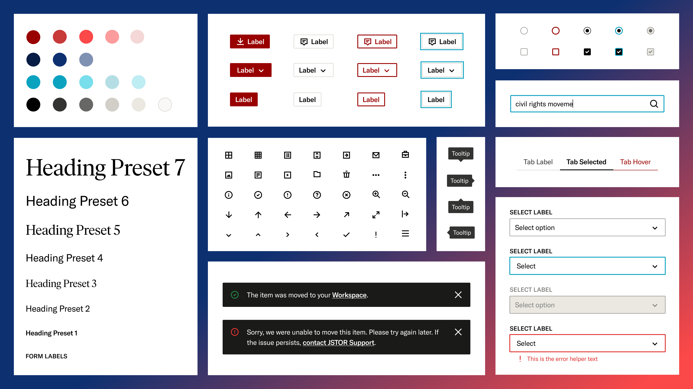

  

<h1 align="center">
  Pharos Design System
</h1>

> Pharos is JSTOR’s design system for creating cohesive, supportive
> and beautiful experiences for the intellectually curious.

> JSTOR is a digital library for the intellectually curious.
> We provide a platform for discovering and connecting research, images, and primary sources.
> As a not-for-profit, we partner with libraries, museums, and publishers to reduce costs, extend access,
> and preserve scholarship for the future. We do this because we believe in the power of knowledge
> to change the world for the better.

  
  
  

## Getting Started

- Check out the [core package](./packages/pharos) for more info about Pharos components and how to get started
- Visit the [Pharos site](https://pharos.jstor.org) to learn about the JSTOR brand, design guidelines, and component usage guidelines
- Explore the [web component Storybook](https://pharos.jstor.org/storybooks/wc/) or the [React Storybook](https://pharos.jstor.org/storybooks/react/) to try the live components
- Test for visual regressions in the Pharos [Chromatic project](https://www.chromatic.com/builds?appId=60919c26122bd50039b34644)

 
 

## Packages and configuration

This repository contains a number of packages related to Pharos:

| Syntax                                        | Description                             |
| --------------------------------------------- | --------------------------------------- |
| [@ithaka/pharos](./packages/pharos)           | Pharos Component library                |
| [@ithaka/pharos-cli](./packages/pharos-cli)   | CLI tool for building Pharos components |
| [@ithaka/pharos-site](./packages/pharos-site) | Site & Documentation for Pharos         |

In addition to these packages, this repository contains [the configuration for Pharos Storybooks](./.storybook).

 
 

## Contributing

If you'd like to learn more about contributing to Pharos, refer to [the contribution guide](./docs/README.md).

## Contributors ✨

Thanks goes to these wonderful people ([emoji key](https://allcontributors.org/docs/en/emoji-key)):

<!-- ALL-CONTRIBUTORS-LIST:START - Do not remove or modify this section -->
<!-- prettier-ignore-start -->
<!-- markdownlint-disable -->
<table>
  <tr>
    <td align="center"><a href="https://niznikr.github.io/"> <b>Robert Niznik</b></a> <a href="https://github.com/ithaka/pharos/commits?author=Niznikr" title="Code">💻</a></td>
    <td align="center"><a href="https://github.com/SMQuazi"> <b>Sayem Quazi</b></a> <a href="https://github.com/ithaka/pharos/commits?author=SMQuazi" title="Code">💻</a></td>
    <td align="center"><a href="https://dane.engineering/"> <b>Dane Hillard</b></a> <a href="https://github.com/ithaka/pharos/commits?author=daneah" title="Code">💻</a></td>
    <td align="center"><a href="https://github.com/jbhakta"> <b>Jayshree Bhakta</b></a> <a href="https://github.com/ithaka/pharos/commits?author=jbhakta" title="Tests">⚠️</a></td>
    <td align="center"><a href="https://evanslawski.com/"> <b>Evan Slawski</b></a> <a href="https://github.com/ithaka/pharos/commits?author=eslawski" title="Code">💻</a></td>
    <td align="center"><a href="https://github.com/kelseytrabue"> <b>Kelsey Cavitt</b></a> <a href="#design-kelseytrabue" title="Design">🎨</a> <a href="https://github.com/ithaka/pharos/commits?author=kelseytrabue" title="Documentation">📖</a></td>
    <td align="center"><a href="https://github.com/jialin-he"> <b>Jialin He</b></a> <a href="https://github.com/ithaka/pharos/commits?author=jialin-he" title="Code">💻</a></td>
  </tr>
  <tr>
    <td align="center"><a href="https://github.com/michael-iden"> <b>Mike Iden</b></a> <a href="https://github.com/ithaka/pharos/commits?author=michael-iden" title="Code">💻</a></td>
    <td align="center"><a href="https://github.com/ymouzakis"> <b>Yanni Mouzakis</b></a> <a href="https://github.com/ithaka/pharos/commits?author=ymouzakis" title="Code">💻</a></td>
    <td align="center"><a href="https://github.com/kentjas1"> <b>Jay Kent</b></a> <a href="https://github.com/ithaka/pharos/commits?author=kentjas1" title="Code">💻</a></td>
    <td align="center"><a href="https://github.com/seanggani"> <b>Sean Anggani</b></a> <a href="https://github.com/ithaka/pharos/commits?author=seanggani" title="Code">💻</a></td>
    <td align="center"><a href="https://github.com/rehanabbasi"> <b>Rehan Abbasi</b></a> <a href="https://github.com/ithaka/pharos/commits?author=rehanabbasi" title="Code">💻</a></td>
    <td align="center"><a href="https://github.com/seanmitchey"> <b>Sean Mitchey</b></a> <a href="https://github.com/ithaka/pharos/commits?author=seanmitchey" title="Tests">⚠️</a></td>
    <td align="center"><a href="https://github.com/cameronheard"> <b>Cameron Heard</b></a> <a href="https://github.com/ithaka/pharos/commits?author=cameronheard" title="Tests">⚠️</a></td>
  </tr>
  <tr>
    <td align="center"><a href="https://github.com/aebankston"> <b>Aparna Bankston</b></a> <a href="https://github.com/ithaka/pharos/commits?author=aebankston" title="Tests">⚠️</a></td>
    <td align="center"><a href="https://github.com/Liza-Pagano"> <b>Liza-Pagano</b></a> <a href="#design-Liza-Pagano" title="Design">🎨</a> <a href="https://github.com/ithaka/pharos/commits?author=Liza-Pagano" title="Documentation">📖</a></td>
    <td align="center"><a href="https://github.com/lorilundy711"> <b>Lori Lundy</b></a> <a href="#design-lorilundy711" title="Design">🎨</a> <a href="https://github.com/ithaka/pharos/commits?author=lorilundy711" title="Documentation">📖</a></td>
    <td align="center"><a href="https://github.com/fswlee"> <b>Florence Lee</b></a> <a href="#design-fswlee" title="Design">🎨</a> <a href="https://github.com/ithaka/pharos/commits?author=fswlee" title="Documentation">📖</a></td>
    <td align="center"><a href="https://github.com/jalex21"> <b>Justin Alexander</b></a> <a href="#a11y-jalex21" title="Accessibility">️️️️♿️</a> <a href="https://github.com/ithaka/pharos/commits?author=jalex21" title="Documentation">📖</a></td>
    <td align="center"><a href="https://github.com/matomaton"> <b>Matthew Martin</b></a> <a href="#design-matomaton" title="Design">🎨</a> <a href="https://github.com/ithaka/pharos/commits?author=matomaton" title="Documentation">📖</a></td>
    <td align="center"><a href="https://github.com/Lham42"> <b>Elham Islam</b></a> <a href="https://github.com/ithaka/pharos/commits?author=Lham42" title="Code">💻</a></td>
  </tr>
  <tr>
    <td align="center"><a href="https://github.com/gbassham"> <b>Gayla Bassham</b></a> <a href="https://github.com/ithaka/pharos/commits?author=gbassham" title="Code">💻</a></td>
    <td align="center"><a href="https://github.com/satya-achanta-venkata"> <b>Satya AchantaVenkata</b></a> <a href="https://github.com/ithaka/pharos/commits?author=satya-achanta-venkata" title="Code">💻</a> <a href="https://github.com/ithaka/pharos/commits?author=satya-achanta-venkata" title="Documentation">📖</a></td>
  </tr>
</table>

<!-- markdownlint-restore -->
<!-- prettier-ignore-end -->

<!-- ALL-CONTRIBUTORS-LIST:END -->

This project follows the [all-contributors](https://github.com/all-contributors/all-contributors) specification. Contributions of any kind are welcome!

 
 

## Work with us at ITHAKA

JSTOR is part of ITHAKA, a not-for-profit dedicated to expanding access to knowledge and education worldwide. Our staff makes us who we are. We’re hiring — join us!

- [See career opportunities](https://recruiting.ultipro.com/ITH1000ITHAK/JobBoard/5fe90ad4-9e26-490b-9c45-6c9669d4dcd0/?q=&o=postedDateDesc)
- [Learn more about ITHAKA](https://ithaka.org/)

## License

This project is available under the MIT license.
For more information, [view the full license and copyright notice](./LICENSE).

Copyright 2021 Ithaka Harbors, Inc.
